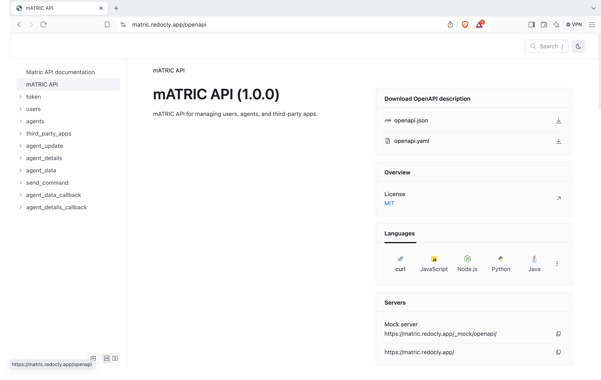

# Matric


mATRIC is multi-Access Technology Intelligent Controller

# Basic overview 
This repository host the mATRIC software implementation platform, an intelligent RAN controller developed under the [](https://reason-open-networks.ac.uk/about/) project to support multiple wireless access technologies.


**The mATRIC platform supports the following capabilities:**

- Real-time and near real-time scenarios.
- Cellular and non-cellular access technologies – _5G, WiFi, LiFi_.
- Monitoring, intelligence and data analytics.
- Control and optimisation of RAN resources.

<a href="https://github.com/tiangolo/full-stack-fastapi-template/actions?query=workflow%3ATest" target="_blank"></a>
<a href="https://coverage-badge.samuelcolvin.workers.dev/redirect/tiangolo/full-stack-fastapi-template" target="_blank"></a>

## Technology Stack and Features

- ⚡ [**FastAPI**](https://fastapi.tiangolo.com) for the Python backend API.
    - 🧰 [SQLModel](https://sqlmodel.tiangolo.com) for the Python SQL database interactions (ORM).
    - 🔍 [Pydantic](https://docs.pydantic.dev), used by FastAPI, for the data validation and settings management.
    - 💾 [PostgreSQL](https://www.postgresql.org) as the SQL database for User Management/Login.
    - 💽 [InfluxDB](https://www.influxdata.com) as the database for Access Point Management.
- 🚀 [React](https://react.dev) for the frontend.
    - 💃 Using TypeScript, hooks, Vite, and other parts of a modern frontend stack.
    - 🎨 [Chakra UI](https://chakra-ui.com) for the frontend components.
    - 🤖 An automatically generated frontend client.
    - 🦇 Dark mode support.
- 🐋 [Docker Compose](https://www.docker.com) for development and production.
- 🔒 Secure password hashing by default.
- 🔑 JWT (JSON Web Token) authentication.
- 📫 Email based password recovery.
- ✅ Tests with [Pytest](https://pytest.org).
- 📞 [Traefik](https://traefik.io) as a reverse proxy / load balancer.
- 🚢 Deployment instructions using Docker Compose, including how to set up a frontend Traefik proxy to handle automatic HTTPS certificates.
- 🏭 CI (continuous integration) and CD (continuous deployment) based on GitHub Actions.

### Dashboard Login

[API docs]

### Dashboard - Admin

[API docs]

### Dashboard - Create User

[API docs]

### Dashboard - Items

[API docs]

### Dashboard - User Settings

[API docs]

### Dashboard - Dark Mode

[API docs]

### Interactive API Documentation

[](https://github.com/REASON-RG/matric-joiner)

## How To Use It

You can clone this repository as is.

- Clone this repository manually:

```bash
git clone https://github.com/REASON-6G/mATRIC-master.git
```

- Enter into the new directory:

```bash
cd matric-master
```

- Push the code to your new repository:

```bash
git push -u origin master
```

### Update From the Original Repository

After cloning the repository, and after doing changes, you might want to get the latest changes from master.

- Make sure you added the original repository as a remote, you can check it with:

```bash
git remote -v

origin    https://github.com/REASON-6G/mATRIC-master.git (fetch)
origin    https://github.com/REASON-6G/mATRIC-master.git (push)
```

- Pull the latest changes without merging:

```bash
git pull --no-commit upstream master
```

This will download the latest changes from master without committing them, that way you can check everything is right before committing.

- If there are conflicts, solve them in your editor.

- Once you are done, commit the changes:

```bash
git merge --continue
```

### Configure

You can then update configs in the `.env` files to customize your configurations.

Before deploying it, make sure you change at least the values for:

- `SECRET_KEY`
- `FIRST_SUPERUSER_PASSWORD`
- `POSTGRES_PASSWORD`

You can (and should) pass these as environment variables from secrets.

Read the [deployment.md](./deployment.md) docs for more details.

### Generate Secret Keys

Some environment variables in the `.env` file have a default value of `changethis`.

You have to change them with a secret key, to generate secret keys you can run the following command:

```bash
python -c "import secrets; print(secrets.token_urlsafe(32))"
```

Copy the content and use that as password / secret key. And run that again to generate another secure key.

## Backend Development

Backend docs: [backend/README.md](./backend/README.md).

## Frontend Development

Frontend docs: [frontend/README.md](./frontend/README.md).

## Deployment

Deployment docs: [deployment.md](./deployment.md).

## Development

General development docs: [development.md](./development.md).

This includes using Docker Compose, custom local domains, `.env` configurations, etc.

## License

Licensed under the terms of the MIT license.
